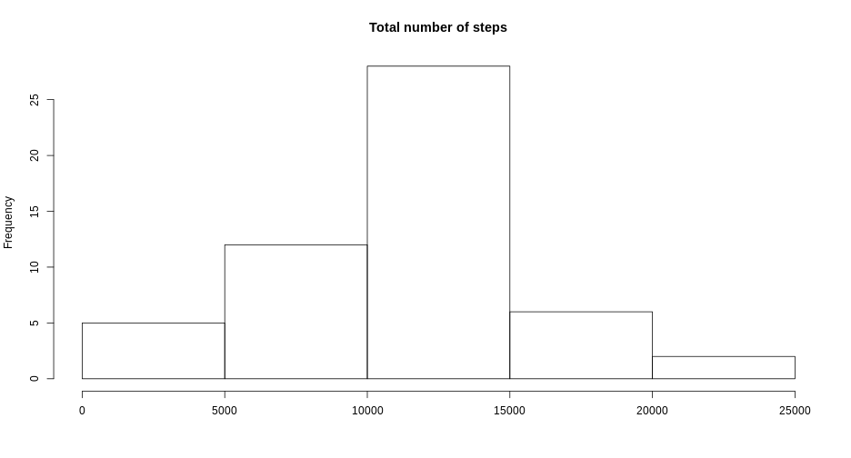
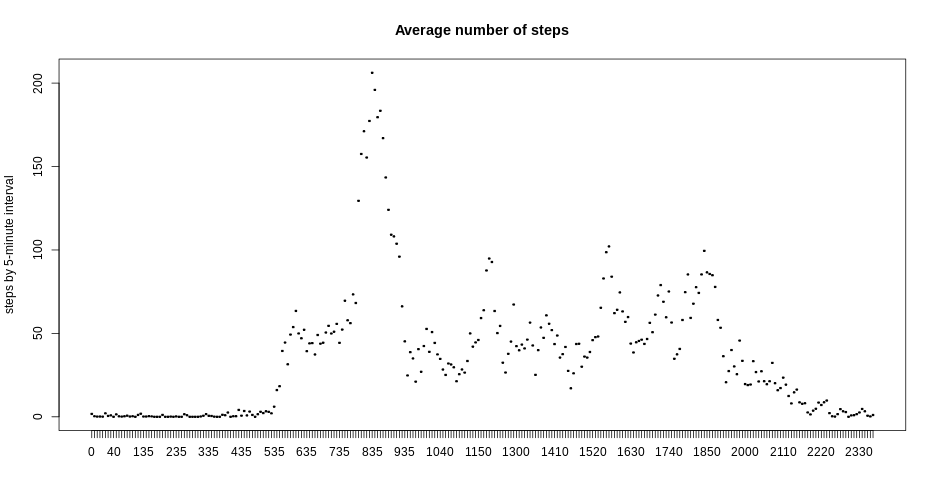
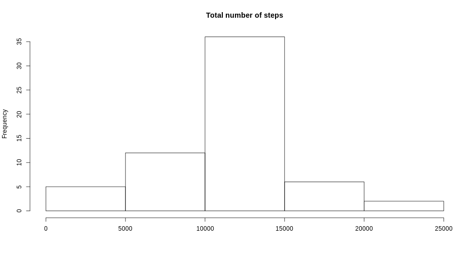

# Reproducible research project
**1. Here we are loading and preprocessing the data**

```r
library(dplyr)
```

```
## 
## Attaching package: 'dplyr'
```

```
## The following objects are masked from 'package:stats':
## 
##     filter, lag
```

```
## The following objects are masked from 'package:base':
## 
##     intersect, setdiff, setequal, union
```

```r
library(knitr)
temp <- tempfile()
download.file("https://d396qusza40orc.cloudfront.net/repdata%2Fdata%2Factivity.zip",temp)
my_file <- unz(temp, "activity.csv")
dat <- read.csv(my_file)
dat[,3]<-factor(dat[,3])
missing<-sum(is.na(dat$steps))
unlink(temp)
```
**2. Here we plot the total number of steps taken each day**

```r
by_date<-group_by(dat,date)
total_date<-summarise(by_date,sum=sum(steps),.groups = 'keep')
with(total_date, hist(sum,main="Total number of steps",xlab=""))
```


**3. Here we calculate the mean and median number of steps taken each day** 

```r
summary(total_date)
```

```
##          date         sum       
##  2012-10-01: 1   Min.   :   41  
##  2012-10-02: 1   1st Qu.: 8841  
##  2012-10-03: 1   Median :10765  
##  2012-10-04: 1   Mean   :10766  
##  2012-10-05: 1   3rd Qu.:13294  
##  2012-10-06: 1   Max.   :21194  
##  (Other)   :55   NA's   :8
```
**4. Here we show the time series plot of the average number of steps taken**

```r
by_interval<-group_by(dat,interval)
mean_interval<-summarise(by_interval,mean=mean(steps,na.rm=TRUE),.groups = 'keep')
with(mean_interval, plot(interval,mean,type = "l",main="Average number of steps",ylab="steps by 5-minute interval"))
```


**5. The 5-minute interval that, on average, contains the maximum number of step is:**

```r
mean_interval[which.max(mean_interval$mean),]
```

```
## # A tibble: 1 x 2
## # Groups:   interval [1]
##   interval  mean
##   <fct>    <dbl>
## 1 835       206.
```
**6. Here we describe and show a strategy for imputing missing data**  
There are 2304 missing values in the original dataset - there are 8 days for which there is no data.  
We will impute the missing data by using the mean for that 5-minute interval.

```r
impute.mean <- function(x) replace(x, is.na(x), mean(x, na.rm = TRUE))
imputed<-mutate(by_interval,steps = impute.mean(steps))
```
**7. Here we show a histogram of the total number of steps taken each day after missing values are imputed**  

```r
imputed_by_date<-group_by(imputed,date)
imputed_total_date<-summarise(imputed_by_date,sum=sum(steps),.groups = 'keep')
with(imputed_total_date, hist(sum,main="Total number of steps",xlab=""))
```


We see that the profile of the data does not change after we impute it.  

```r
summary(imputed_total_date)
```

```
##          date         sum       
##  2012-10-01: 1   Min.   :   41  
##  2012-10-02: 1   1st Qu.: 9819  
##  2012-10-03: 1   Median :10766  
##  2012-10-04: 1   Mean   :10766  
##  2012-10-05: 1   3rd Qu.:12811  
##  2012-10-06: 1   Max.   :21194  
##  (Other)   :55
```
*Note that in the original calculation and histogram I do not remove the 8 days for which we have no data.*  
*If you use na.rm=TRUE to remove the missing values, they are still counted as 0 in any summary statistics.*  
*As a result the mean/median total number of steps per day will be lower, because the 8 missing days are all taken as 0 in the numerator, while the denominator is higher.*  
*I took this approach because I think it's unrealistic that no steps were taken on those 8 days.*  
*Rather the more plausible explanation is that the person did not wear his or hers activity tracker on that day. The effect of this can be seen below.*   
  
*Missing data not removed from the original data set. Note that there are 8 missing values and the minimum number of steps is 41:*  

```r
summary(total_date)
```

```
##          date         sum       
##  2012-10-01: 1   Min.   :   41  
##  2012-10-02: 1   1st Qu.: 8841  
##  2012-10-03: 1   Median :10765  
##  2012-10-04: 1   Mean   :10766  
##  2012-10-05: 1   3rd Qu.:13294  
##  2012-10-06: 1   Max.   :21194  
##  (Other)   :55   NA's   :8
```

*Missing data removed from the original data set. Note that there are no missing values and the minimum number of steps is 0:*  

```r
removed_total_date<-summarise(by_date,sum=sum(steps,na.rm=TRUE),.groups = 'keep')
summary(removed_total_date)
```

```
##          date         sum       
##  2012-10-01: 1   Min.   :    0  
##  2012-10-02: 1   1st Qu.: 6778  
##  2012-10-03: 1   Median :10395  
##  2012-10-04: 1   Mean   : 9354  
##  2012-10-05: 1   3rd Qu.:12811  
##  2012-10-06: 1   Max.   :21194  
##  (Other)   :55
```
**8. Here we make a panel plot comparing the average number of steps taken per 5-minute interval across weekdays and weekends**

```r
imputed$date<-as.Date(imputed$date)
imputed$weekday<-as.factor(weekdays(imputed$date))
weekend <- c("Saturday","Sunday")
imputed$weekend <- as.factor(ifelse(imputed$weekday %in% weekend, "weekend","weekday"))
imputed_weekdays<-filter(imputed,weekend=="weekday")
imputed_weekends<-filter(imputed,weekend=="weekend")
weekdays_interval<-group_by(imputed_weekdays,interval)
interval_weekdays<-summarise(weekdays_interval,mean=mean(steps,na.rm=TRUE),.groups = 'keep')
weekends_interval<-group_by(imputed_weekends,interval)
interval_weekends<-summarise(weekends_interval,mean=mean(steps,na.rm=TRUE),.groups = 'keep')
par(mfrow=c(2,1), mar=c(4,2,1,1))
with(interval_weekdays, plot(interval,mean,type = "l",main="Average number of steps in weekdays"))
with(interval_weekends, plot(interval,mean,type = "l",main="Average number of steps in weekends"))
```


